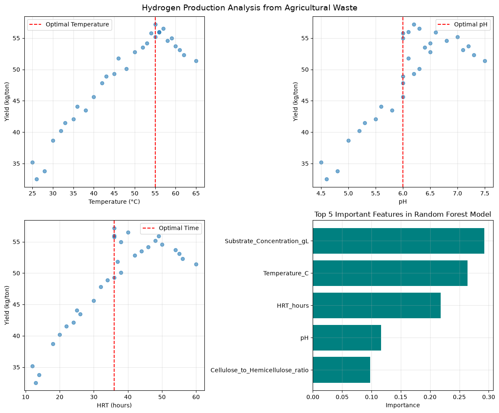

# Hydrogen Production Prediction from Agricultural Waste
# 农业废弃物产氢预测

## Project Overview / 项目概述
This project is developed for the BRICS Competition 2026 to predict hydrogen yield from agricultural waste using machine learning techniques. The goal is to optimize production conditions and identify key factors affecting hydrogen generation.

本项目为2026年BRICS竞赛开发，利用机器学习技术预测农业废弃物的产氢量，旨在优化生产条件并识别影响产氢的关键因素。

---

## Objectives / 目标
- Predict hydrogen yield (kg/ton) based on process parameters / 基于工艺参数预测产氢量（公斤/吨）
- Compare Linear Regression versus Random Forest models / 比较线性回归与随机森林模型
- Identify optimal conditions for maximum production / 确定最大产量的最优条件
- Analyze feature importance / 分析特征重要性

---

## Dataset Features / 数据集特征

Numerical / 数值特征:
- Temperature (C) / 温度
- pH / pH值
- Substrate Concentration (g/L) / 底物浓度
- HRT (hours) / 水力停留时间
- Cellulose-to-Hemicellulose ratio / 纤维素/半纤维素比

Categorical / 分类特征:
- Pretreatment Type / 预处理类型
- Climate Type / 气候类型

Target / 目标变量:
- Hydrogen Yield (kg/ton) / 产氢量（公斤/吨）

---

## Technologies / 技术栈
- Python 3.x
- Pandas, NumPy
- Scikit-learn
- Matplotlib, Seaborn

---

## Models / 模型

Linear Regression / 线性回归:
- Simple and interpretable / 简单且可解释
- Fast training / 训练速度快

Random Forest Regressor / 随机森林回归:
- Ensemble learning / 集成学习
- Captures non-linear patterns / 捕捉非线性关系
- Feature importance analysis / 特征重要性分析

---

## Data Processing / 数据处理
- One-Hot Encoding for categorical features / 分类特征独热编码
- Pipeline for preprocessing and training / 预处理和训练流水线
- Train-test split: 80% - 20% / 训练测试集划分：80%-20%

---

## Results Visualization / 结果可视化

*Figure 1: Analysis of hydrogen production from agricultural waste showing temperature, pH, HRT effects and feature importance*

*图1: 农业废弃物产氢分析 - 温度、pH、水力停留时间影响及特征重要性*

---

## Results / 结果
The Random Forest model outperforms Linear Regression. Temperature and Pretreatment Type are the most influential factors.

随机森林模型优于线性回归。温度和预处理类型是最关键的影响因素。

Optimal Conditions / 最优条件:
- Temperature / 温度: 55°C
- pH / pH值: 6.0
- Substrate Concentration / 底物浓度: 35 g/L
- HRT / 水力停留时间: 36 hours
- Pretreatment / 预处理: Alkaline / 碱处理
- Climate / 气候: Temperate / 温带

---

## Visualizations / 可视化
Four plots generated / 生成四张图:
1. Temperature vs Yield / 温度与产氢量
2. pH vs Yield / pH与产氢量
3. HRT vs Yield / 水力停留时间与产氢量
4. Feature Importance / 特征重要性

---

## How to Run / 运行方法

`bash
pip install pandas numpy scikit-learn matplotlib seaborn
python hydrogen_prediction.py
